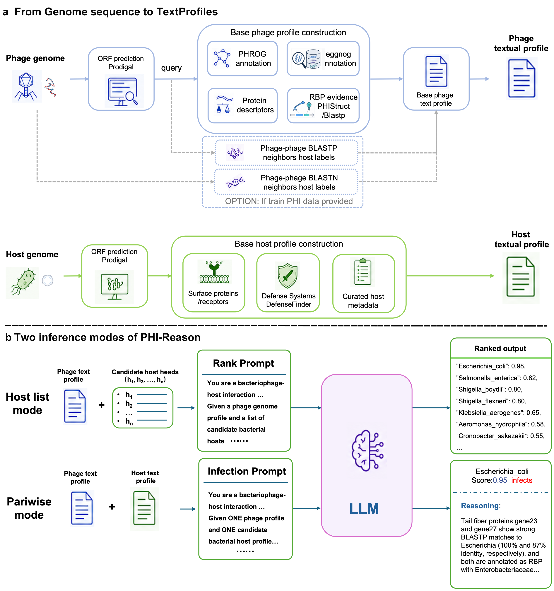

# PHI-Reason



Code for **PHI-Reason**: an LLM-based phage–host interaction prediction framework that integrates multi-channel genomic evidence (RBP annotations, BLASTN neighbours, BLASTP neighbours) into structured text profiles and queries a reasoning LLM to predict phage host range at species level.

---

## Repository structure

```
PHI-Reason-Species/
├── config.sh                              # Path configuration — edit before first run
├── requirements.txt                       # Python dependencies
│
├── 00_annotation/                         # Upstream genome annotation wrappers
│   ├── run_prodigal.sh                    # Gene prediction (Prodigal)
│   ├── run_phrog.sh                       # PHROG functional annotation (DIAMOND)
│   ├── run_eggnog.sh                      # eggNOG-mapper annotation
│   ├── run_defensefinder.sh               # Defense system detection (hosts)
│   └── run_blastn.sh                      # Whole-genome BLASTN (train DB → test queries)
│
├── 01_profile_generation/                 # Build phage and host text profiles
│   ├── phage_profiles/
│   │   ├── build_phage_profiles_base.py   # Stage 0: base profiles from PHROG + proteins.faa
│   │   ├── build_phage_profiles_rbp.py    # Stage 1a: add RBP BLASTP annotations
│   │   ├── build_phage_profiles.py        # Stage 1b: add BLASTN phylogenetic context
│   │   ├── build_blastn_neighbors_json.py # Convert BLASTN TSV → neighbor JSON for Stage 1b
│   │   └── mask_phage_ids.py              # Mask test phage accessions in profile headers
│   ├── host_profiles/
│   │   ├── build_host_profiles_base.py    # Stage 1: base host profiles from eggNOG + DefenseFinder
│   │   ├── build_host_profiles.py         # Stage 2: enrich with NCBI taxonomy + curated knowledge
│   │   └── build_host_list.py             # Generate candidate host list for the prompt
│   └── blastp_context/                    # BLASTP phylogenetic context (run in order)
│       ├── 01_build_db.py                 # Build DIAMOND protein database from train set (supports --train-list)
│       ├── 02_run_query.sh                # Run diamond blastp: test phages vs. train DB
│       ├── 03_extract_neighbors.py        # Aggregate hits → top-5 neighbor JSON
│       ├── 04_build_context_blocks.py     # Format neighbours into LLM-ready context blocks
│       └── 05_inject_context.py           # Inject BLASTP blocks into phage profiles
│
├── 02_inference/                          # LLM inference
│   ├── run_inference.py                   # Main inference driver (async, concurrent, resumable)
│   └── prompt/
│       └── prompt_template.py             # System prompt and user message templates
│
├── 03_experiments/
│   └── run_experiments.sh                 # Run the four core experiments sequentially
│
├── 04_baseline/
│   ├── evaluate_baseline.py               # Evaluate baseline tools (PHP, WIsH, PHIST, etc.)
│   └── README.md                          # Per-tool installation and usage instructions
│
└── data/                                  # Benchmark phage–host pair tables
    ├── cherry_phage_host_pair.csv          # Cherry 1,940 pairs (train/test split)
    ├── cherry_test_634.txt                # RefSeq-634 test accessions
    ├── vhdb_phage_host_pair.csv            # VHDB 4,430 pairs (train/test split)
    └── hic_phage_host_pair.csv            # metaHiC 395 proximity-ligation pairs
```

---

## Requirements

### System dependencies

| Tool | Purpose | Install |
|------|---------|---------|
| [Ollama](https://ollama.com) | Serve local LLM | See ollama.com |
| [DIAMOND](https://github.com/bbuchfink/diamond) | Protein similarity search | `conda install -c bioconda diamond` |
| [BLAST+](https://blast.ncbi.nlm.nih.gov/doc/blast-help/) | Nucleotide similarity search | `conda install -c bioconda blast` |
| [Prodigal](https://github.com/hyattpd/Prodigal) | Gene prediction | `conda install -c bioconda prodigal` |

### Python dependencies

```bash
pip install -r requirements.txt
```

Requires Python 3.10+.

---

## Setup

**1. Configure project root**

Edit `config.sh` or set the environment variable before running any script:

```bash
export PHI_PROJECT_ROOT=/path/to/your/project
```


**2. (Optional) Override tool paths**

```bash
export DIAMOND_BIN=/path/to/diamond
export PRODIGAL_BIN=/path/to/prodigal
```

---

## Pipeline walkthrough

### Step 0 — Genome annotation

Annotate phage and host genomes with Prodigal, PHROG, eggNOG-mapper, and DefenseFinder. See scripts in `00_annotation/` for usage.

```bash
# Predict genes
bash 00_annotation/run_prodigal.sh \
    --genome-dir data/Cherry_data/phage \
    --out-dir    data/Cherry_data/phage

# Annotate with PHROG
bash 00_annotation/run_phrog.sh \
    --prot-dir   data/Cherry_data/phage \
    --phrog-db   /path/to/phrogs_db.dmnd \
    --out-dir    data/Cherry_data/phage

# Run whole-genome BLASTN (train phages as reference, test phages as query)
bash 00_annotation/run_blastn.sh \
    --train-genomes data/Cherry_data/train_phages \
    --query-genomes data/Cherry_data/phage \
    --query-list    ws/Cherry/phage_list_634.txt \
    --out-dir       ws/Cherry/blastn_search
```

### Step 1 — Build phage profiles (3 stages)

```bash
# Stage 0: base profiles from PHROG annotations
python 01_profile_generation/phage_profiles/build_phage_profiles_base.py \
    --phage-dir    data/Cherry_data/phage \
    --phrog-lookup data/phrog_lookup.tsv \
    --out-dir      ws/Cherry/phage_profiles_base

# Stage 1a: add RBP BLASTP annotations
python 01_profile_generation/phage_profiles/build_phage_profiles_rbp.py \
    --base-profiles ws/Cherry/phage_profiles_base \
    --prot-dir      data/Cherry_data/phage \
    --phrog-json    data/phrog_by_phage.json \
    --rbp-table     data/rbp_phage_host_table.csv \
    --work-dir      ws/Cherry/rbp_work \
    --out-dir       ws/Cherry/phage_profiles_rbp

# Stage 1b: add BLASTN phylogenetic context
python 01_profile_generation/phage_profiles/build_blastn_neighbors_json.py \
    --blastn-tsv ws/Cherry/blastn_search/blastn_hits.tsv \
    --host-csv   data/Cherry_data/phage1940_host_pair.csv \
    --out-json   ws/Cherry/blastn_neighbors.json

python 01_profile_generation/phage_profiles/build_phage_profiles.py \
    --base-profiles ws/Cherry/phage_profiles_rbp \
    --blastn-json   ws/Cherry/blastn_neighbors.json \
    --out-dir       ws/Cherry/phage_profiles_rbp_blastn

# Mask test phage accessions in profile headers (prevents LLM memorisation)
python 01_profile_generation/phage_profiles/mask_phage_ids.py \
    --src-dir ws/Cherry/phage_profiles_rbp_blastn \
    --out-dir ws/Cherry/phage_profiles_rbp_blastn_masked
```

### Step 2 — Build host profiles and host list

```bash
# Stage 1: base host profiles from eggNOG + DefenseFinder
python 01_profile_generation/host_profiles/build_host_profiles_base.py \
    --anno-dir    data/Cherry_data/host \
    --defense-dir data/Cherry_data/host \
    --out-dir     ws/Cherry/host_profiles_base

# Stage 2: enrich with NCBI taxonomy
python 01_profile_generation/host_profiles/build_host_profiles.py \
    --base-profiles ws/Cherry/host_profiles_base \
    --out-dir       ws/Cherry/host_profiles_v3

# Generate candidate host list
python 01_profile_generation/host_profiles/build_host_list.py \
    --host-prof ws/Cherry/host_profiles_v3 \
    --out       ws/Cherry/host_list_v4G.txt
```

### Step 3 — Add BLASTP context (optional, improves accuracy)

```bash
# 1. Build train-set protein DB
#    Use --train-list when train and test phages share the same parent directory
python 01_profile_generation/blastp_context/01_build_db.py \
    --train-dir  data/Cherry_data/phage \
    --train-list data/Cherry_data/train_acc.txt \
    --pair-csv   data/Cherry_data/phage1940_host_pair.csv \
    --out-dir    experiments/blastp_db

# 2. Query test phages against train DB
bash 01_profile_generation/blastp_context/02_run_query.sh \
    --db         experiments/blastp_db/train_phage_prot.dmnd \
    --phage-dir  data/Cherry_data/phage \
    --phage-list ws/Cherry/phage_list_634.txt \
    --out-dir    experiments/blastp_query

# 3. Extract neighbours
python 01_profile_generation/blastp_context/03_extract_neighbors.py \
    --tsv       experiments/blastp_query/blastp_hits.tsv \
    --pair_csv  experiments/blastp_db/train_phage_host_pair.csv \
    --out_json  experiments/blastp_query/neighbors_top5.json

# 4. Build context blocks
python 01_profile_generation/blastp_context/04_build_context_blocks.py \
    --neighbors_json experiments/blastp_query/neighbors_top5.json \
    --pair_csv       experiments/blastp_db/train_phage_host_pair.csv \
    --out_json       experiments/blastp_query/blastp_context.json

# 5. Inject into profiles (use masked profiles as source)
python 01_profile_generation/blastp_context/05_inject_context.py \
    --src_dir      ws/Cherry/phage_profiles_rbp_blastn_masked \
    --context_json experiments/blastp_query/blastp_context.json \
    --out_dir      ws/Cherry/phage_profiles_rbp_blastn_blastp
```

### Step 4 — Run inference

```bash
python 02_inference/run_inference.py \
    --exp-id         my_experiment \
    --host-list      ws/Cherry/host_list_v4G.txt \
    --pair-csv       data/Cherry_data/phage1940_host_pair.csv \
    --phage-list     ws/Cherry/phage_list_634.txt \
    --phage-prof-dir ws/Cherry/phage_profiles_rbp_blastn_blastp \
    --model          qwen3-coder-next:q4_K_M \
    --concurrency    4 \
    --num-ctx        40960 \
    --num-predict    4096
```

Results are written to `experiments/my_experiment/results/metrics.json`. Inference is resumable — re-running the same `--exp-id` skips already-completed phages.

**Key inference options:**

| Option | Default | Description |
|--------|---------|-------------|
| `--model` | `qwen3-coder-next:q4_K_M` | Ollama model tag |
| `--ollama-urls` | `http://127.0.0.1:11434` | Comma-separated Ollama endpoints (multi-GPU) |
| `--concurrency` | `12` | Number of parallel requests |
| `--think` | `auto` | `yes` / `no` / `auto` — chain-of-thought mode |
| `--pilot` | — | Run on first N phages only (for testing) |
| `--overwrite` | — | Re-run even if cached result exists |

---

## Benchmark datasets

The `data/` directory contains phage–host pair tables and test-set identifiers for all benchmarks used in the paper.

| File | Records | Description |
|------|---------|-------------|
| `cherry_phage_host_pair.csv` | 1,940 pairs | Cherry *et al.* (2021) phage–host pairs with `train`/`test` split column |
| `cherry_test_634.txt` | 634 accessions | Test-set phage accessions for the RefSeq-634 benchmark |
| `vhdb_phage_host_pair.csv` | 4,430 pairs | Edwards *et al.* Virus–Host DB pairs with `train`/`test` split column |
| `hic_phage_host_pair.csv` | 395 pairs | metaHiC proximity-ligation pairs (no split column; split by cross-validation) |

**Column format:** `phage_id, host_species[, split]`. Host species names use underscores (e.g. `Escherichia_coli`).

---

## Baseline evaluation

See [`04_baseline/README.md`](PHI-Reason-Species/04_baseline/README.md) for step-by-step instructions on installing each baseline tool and computing metrics.

```bash
git clone https://github.com/KennthShang/HostPredictionReview.git
export HOST_PREDICTION_REVIEW_DIR=/path/to/HostPredictionReview

python 04_baseline/evaluate_baseline.py \
    --tool       wish \
    --outputs    experiments/baseline_wish/outputs \
    --review-dir ${HOST_PREDICTION_REVIEW_DIR}
```

Supported tools: `php`, `wish`, `phist`, `deephost`, `phabox2`, `vhmnet`.

---

## Citation

> Zhang, Y.-Z., Xu, L., & Imoto, S. (2026). PHI-Reason: Evidence-grounded species-level phage-host prediction from structured biological text profiles. bioRxiv. https://doi.org/10.64898/2026.06.10.727770
